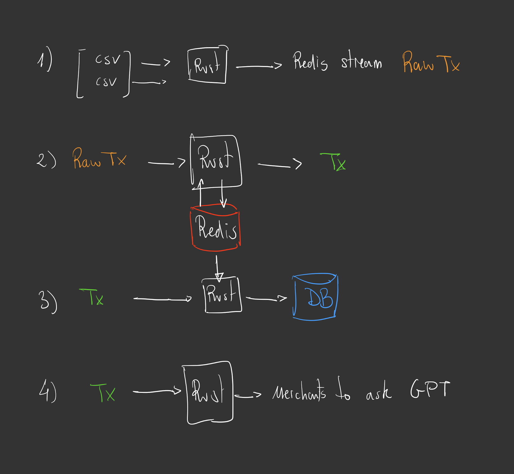

# The project
## Discleamer
There are 2 goals in this project:
- Experiment with different techonologies that I'll use on a new work project where I got the permision to use rust
    - Shared schema contracts across services and auto code generation in rust and python
    - Redis streams
    - Rust interaction with redis and with SQL databases
- Bring my beloved co-workers up to speed in rust

The solution to the "real problem" is chosed to achieve the prior goals, and not to solve the problem itself. This is why it will result in a blazingly complex solution to a very simple problem. Let's have fun.

## The problem
A long time ago in a galaxy far, far away...
A friend of a friend had a bank that was not equipped with an expense tracker, it allowed him to see all his transactions and export them to `csv`, but the user didn't have any means to know his monthly expenses.

He asked a group of intrepid software engineers to build a solution to allow him to determine his montly expenses.They needed to get **all** the transactions from **any** number of `csvs` (He was very lazy and didn't want to delete any old `csv` so transactions could be duplicated or modified from one export to the other) He wanted to have all his transactions on the latest version, uploaded to a SQL database, where with the help of an extremely intelligent robot that would take everyones jobs, would categorize each expense.

## The solution

There will be 3 microservices that will perform these tasks:
1. `sourcer`: Read all the transactions from a list of csvs and push tehm to `RawTx` redis stream. The transactions could be duplicated and on different versions because there can be overlap in the exports
2. `refactorer`: Consume from `RawTx` and make sure to keep the latest version of each transaction to Redis. This is very similar to be receiving duplicated or out order order updates from an exchange. Then push the transaction to the `Tx` redis stream.
3. `b2b`: Consume `Tx` stream and push the latest version to a SQL database (postgres)
4. `b2b`: Consume `Tx` stream and preapre a csv of unique merchants to which we don't know the expense category for, then use ChatGPT to generate an expense category table in the postgres Database

We will define the data contracts to use on the streams as `json-schema`. They are defined in the schemas folder, and synced to the services using the `schema_sync.sh` script.

In a real project the schemas could be in a different subrepo and any changes to be tagged with versions. Every microservice wwould the pull from the gitsubrepo and use the versioning as needed.

# Running the code

## Requirements
- Rust, of course
- Code generator: `npm install -g quicktype`
- Local redis instance
- Local postgres instance

